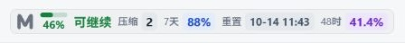
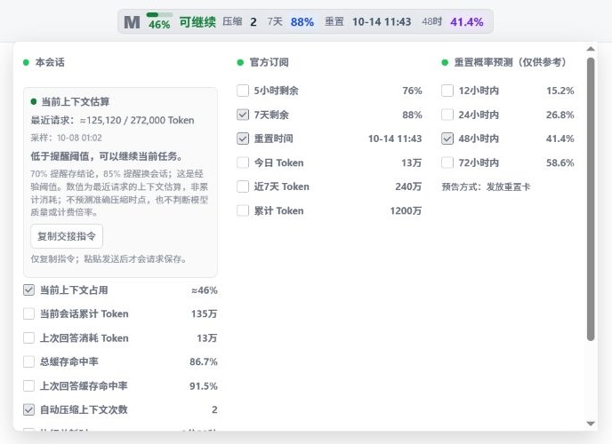

# CtxMeter · S


Windows 版 Codex Desktop 的顶部上下文与用量监视器，默认使用 **S** 作为紧凑标识，桌面图标保留 **M**。产品版本 **1.2.1**，完整维护编号 **1.2.1+ctx.1**。提供三种可切换的顶部样式、上下文提醒及用量统计。

[下载最新安装包](https://github.com/mingze21/CtxMeter/releases/latest) · [更新记录](CHANGELOG.md) · [问题反馈](https://github.com/mingze21/CtxMeter/issues)

顶部显示紧凑的进度条、百分比和中文行动提示。展开面板可查看采样时间、上下文容量、会话 Token、订阅额度和已配置的数据源。

本产品独立维护，不属于 OpenAI 官方软件。开源许可及来源归因见 [LICENSE](LICENSE) 和 [NOTICE.md](NOTICE.md)。

## 界面预览

以下为真实界面使用演示数据的截图，不包含用户实际账户或会话数据。顶部示例采用“数字胶囊”样式。





展开面板可滚动查看下方条目与设置。

## 来源与改进

这个项目结合了两款软件的长处，并按实际使用需求持续改进：

- **Codex Usage Monitor for Windows**：以 [JiaYang-BUAA/Codex-Desktop-Usage-Monitor-Windows v3.1.7](https://github.com/JiaYang-BUAA/Codex-Desktop-Usage-Monitor-Windows) 为代码基础，延续用量采集、订阅额度、设置面板及 Windows 启动流程。
- **[Nudge](https://github.com/yuxinz77/nudge-ai)**：借鉴紧凑上下文进度指示、红黄绿状态，以及及时保存结论和切换会话的提醒思路。本项目中的相关功能在现有监视器基础上实现，未打包 Nudge 的程序、源码、图标或品牌素材。
- **本项目改进**：顶部布局、当前聊天上下文估算、中文行动提示、统一状态色、三种可选样式、数字与重置时间的可读性，以及可自行修改的顶部 S 标识、独立 M 图标和手动更新策略。

感谢原项目与相关工具带来的启发。代码继承、第三方数据来源和许可证记录见 [NOTICE.md](NOTICE.md)。

## 上下文提醒

| 状态 | 当前上下文占用 | 提示 |
| --- | --- | --- |
| 绿色 | 低于 70% | 可继续 |
| 黄色 | 70% 至低于 85% | 存结论 |
| 红色 | 85% 及以上 | 换会话 |
| 灰色 | 无有效采样／压缩后等待新采样 | 不可用／待更新 |

上下文百分比、进度条和提示使用同一状态颜色。占用基于当前聊天的最近一次有效日志采样，属于**估算**；它不是会话累计 Token，也不是计费倍率或模型质量的判断。新输入和工具结果可能要等下一次采样后才反映出来。

达到提醒阈值时，可以先保存结论、关键约束和未完成事项，再考虑换会话。展开面板中的交接指令可复制后自行发送；监视器不会自动写记忆文件、结束聊天或创建新会话。70%／85% 是工作节奏提醒阈值，不代表模型开始“降智”。

## 安装与启动

需要 Windows 10/11、Codex Desktop、Node.js 22 或更高版本，以及 PowerShell。建议使用 PowerShell 7。

1. 从 [v1.2.1 Releases](https://github.com/mingze21/CtxMeter/releases/tag/v1.2.1) 下载 `ctxmeter-1.2.1.zip`（安装包，而非 GitHub 自动生成的 Source code），用同页 `.sha256` 文件核验后解压，阅读 [AGENTS.md](AGENTS.md)。
2. 在解压目录执行：

   ```powershell
   pwsh -NoProfile -File .\install.ps1
   ```

   没有 PowerShell 7 时可使用：

   ```powershell
   powershell -NoProfile -ExecutionPolicy Bypass -File .\install.ps1
   ```

3. 使用桌面的 **CtxMeter** 快捷方式启动。若当前 Codex 已带监视端口运行，可直接接入；若它通过普通入口启动且没有监视端口，需先自行正常退出，再使用专用快捷方式。

默认程序目录：

```text
%LOCALAPPDATA%\Programs\CtxMeter\1.2.1
```

安装器不会强制关闭或重启 Codex，也不会改动 WindowsApps、`app.asar`、登录文件、模型设置或原生 Codex 快捷方式。标题栏没有足够空间时，会回退到输入区域附近。

## 顶部样式

点击顶部监视栏，展开“官方订阅”栏中的“设置”，在“顶部样式”选择：

- **清晰分层**：数值加粗、标签弱化，保持紧凑的单行显示。
- **数字胶囊**：数值使用浅色胶囊，重置日期时间也加入胶囊；标签保留在外。
- **上下两层**：每项上方显示标签、下方显示数值，适配标题栏可用空间。

选择立即生效，并随原有设置保存，重新启动后恢复。旧设置和无效选项默认使用“清晰分层”。样式选择不改变指标口径、勾选顺序或上下文阈值；极简模式仍可用于隐藏一般指标标签。上下文沿用红黄绿，剩余额度采用蓝色，普通计数使用深色，重置时间加粗；深色主题使用相应的浅色数值。

## 自定义顶部字母

顶部默认显示 **S**，可以改为自己喜欢的字母。打开解压目录中的 `assets/usage-constants.js`，找到并修改：

```javascript
TOPBAR_MARK: "S",
```

例如把 `"S"` 改为 `"A"`，保存后重新运行该目录中的 `install.ps1`，再通过桌面 **CtxMeter** 快捷方式启动。当前 Codex 会话不便退出时，可按[故障排查指南](docs/troubleshooting.md)中的后台替换方式刷新监视器。字母修改不影响上下文指标、状态颜色或桌面的 M 图标；后续安装新版时需重新应用自己的字母修改。

## 本会话与其他指标

“本会话”可显示当前会话累计 Token、上次回答消耗 Token、缓存命中率、上次回答缓存命中率、自动压缩上下文次数和执行耗时。复选框控制顶部展示，统计仍会继续。

- 官方订阅：读取可用的订阅额度周期，无需额外 API Key；累计及近7天 Token 根据本机日志统计。
- API 账户：可显示账户余额、消耗及请求状态。接入前应核对服务商公开接口，按需设置**累计 Token 基准**。
- API Key：仅在服务商提供支持的用量接口并完成本地配置后可用。
- 界面：保留极简模式、倒计时可视化、中英文和刷新频率设置；网络用量默认约每 60 秒刷新。
- 额度恢复续跑：只对用户明确启用且因官方额度不足暂停的任务生效。它与上下文提醒相互独立。

不要把凭据粘贴到聊天、源码或普通 JSON 文件。已有配置使用 Windows DPAPI 保存；新增凭据仍通过本机剪贴板配置流程处理。指标口径、社区预测来源和 API 配置细节见 [数据来源说明](docs/data-sources.md)。

## 设置兼容与版本维护

为沿用已安装版本的设置和加密凭据，保留内部状态目录：

```text
%LOCALAPPDATA%\CodexUsageMonitor
```

这是兼容路径，不是产品展示名称。UI 选择、统计计数、端口发现、DPAPI 加密上下文和内部协议标识保持兼容；无需迁移用户数据。程序文件使用新的 CtxMeter 安装目录。

本产品采用**手动更新**：不会检查、下载或安装原项目的发布包，避免覆盖定制功能。源码中保留的旧更新模块仅用于兼容性测试，监视器运行入口不加载它们；旧 `updateNotifications` 设置不会触发更新。

完整维护编号及直接修改基线记录在 `BUILD-INFO.json`；本次 `1.2.1+ctx.1` 的顶部样式直接继承自用 S 版 `1.2.0+ctx.local.1`，该版基于上一公开版 `1.2.0+ctx.1`。本次将顶部 S 统一为公开默认值，增加字母修改入口与说明，保留 CtxMeter 名称、M 桌面图标、已有功能和配置兼容。历史维护编号保留原样，用于追溯继承关系。不要用版本号大小判断不同产品分支的新旧，也不要用原项目更新包覆盖本产品。

## 开发、测试与打包

```powershell
npm ci --ignore-scripts
pwsh -NoProfile -File .\tests\run-tests.ps1
pwsh -NoProfile -File .\scripts\build-release.ps1
```

打包输出 `dist\ctxmeter-1.2.1.zip`。仅包含清单允许的源码、图标和文档，不包含用户凭据、运行日志、Node.js 或 Codex 二进制文件。

需要停止监视器并移除当前页面显示时，执行 `scripts\restore-monitor.ps1`；该命令不终止 Codex。故障排查和不重启 Codex 的后台替换方式见 [故障排查指南](docs/troubleshooting.md)。
